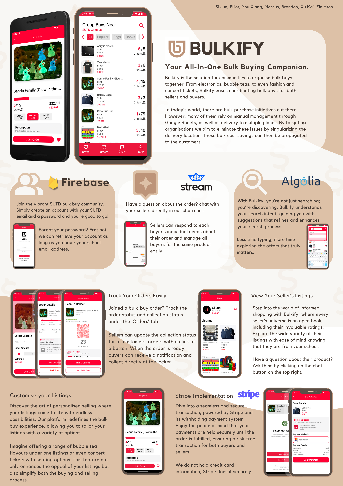

# Bulkify (Android Mobile App)

## Description

Welcome to Bulkify. Bulkify is a mobile app that aims to allow organisations to bulk purchase items together for a more convenient and cost saving experience. There are some
bulk purchase initiatives out there in today's world, but many of them rely on manual management through google sheets, as well as delivery to multiple places. This results in
little benefit to suppliers as well as many communication issues that have arised, such as in the website Massdrop. By targeting organisations or in particular, schools, we help to
eliminate all these issues as the delivery location at a singular location. These bulk cost savings can then be propagated to the customers.

 

  

 

As part of an extension of our mobile app, we created a hardware locker which is integrated into our app. This allows the seller to scan a QR code to unlock and place items inside
an assigned locker. Buyers will then be notified of this and they can similarly scan the same QR code to unlock the assigned locker and retrieve the items purchased. This way, trust and convenience is achieved for both buyers as well as merchants of our app.

  

 

Check out the below video for more details on our Android application done in Java language.
 

  

 
This app was done for a school project entering our second year for the 50.001 module "Introduction To Information Systems And Programming". We only had about 5 weeks to learn app development from scratch and execute this project. 

We also achieved 3rd place out of 30 teams in the course, judged by Singtel Engineers.
Check out here to view our full report!
* To be updated when we upload it

## Team Details
<b>Team number: 30</b>

<b>Members:</b>  
1006904 Yang Si Jun  
1007064 Kyaw Zin Htoo 
1006855 Lim Wei Ren Marcus 
1007090 Brandon Ng Joon Hoe 
1007226 Teo Xu Kai 
1007220 Teo You Xiang 
1006967 Phua Jia Jing Elliot

## Running the app
Do take note you will have errors running the app since we did not upload our credentials for database etc. Do reach out to me through my socials if you are interested in
a demo of the App.
